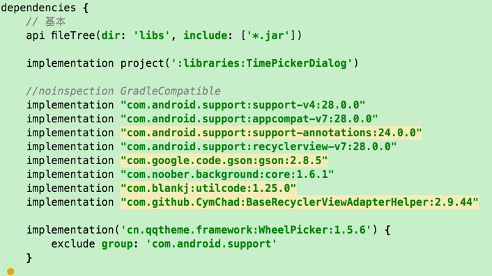
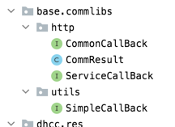

# 总结一些常用组件

# 与工程项目注意事项:

1,将TimePickerDialog抽离,原项目可settings.gradle 中去掉 include ':libraries:TimePickerDialog'

2,dhcc_res 不同地方

- 1) 依赖,原baselibs去掉
> implementation project(':libraries:TimePickerDialog')

> implementation "com.android.support:support-v4:28.0.0"

> implementation "com.android.support:appcompat-v7:28.0.0"

> implementation "com.android.support:support-annotations:24.0.0"

> implementation "com.android.support:recyclerview-v7:28.0.0"
    
> implementation "com.google.code.gson:gson:2.8.5"

> implementation "com.noober.background:core:1.6.1"
    
> implementation "com.blankj:utilcode:1.25.0"
    
> implementation "com.github.CymChad:BaseRecyclerViewAdapterHelper:2.9.44"

> implementation('cn.qqtheme.framework:WheelPicker:1.5.6') {
        exclude group: 'com.android.support'
  }

- 2)去四个类:
> com.base.commlibs.http
        ---CommonCallBack
        ---CommResult
        ---ServiceCallBack
> com.base.commlibs.utils
        ---SimpleCallBack

# 常用库:
- 1,utilcode
https://github.com/Blankj/AndroidUtilCode

- 2,background
https://github.com/JavaNoober/BackgroundLibrary

- 3,BaseRecyclerViewAdapterHelper
https://github.com/CymChad/BaseRecyclerViewAdapterHelper

- 4,配合TimePickerDialog
cn.qqtheme.framework:WheelPicker

